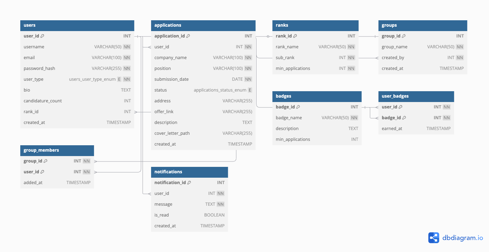

# HelloCandidate - Plateforme de suivi de candidatures avec gamification

## 📌 Objectif du projet

HelloCandidate est une plateforme destinée aux étudiants en recherche d'alternance, offrant :
- **Suivi des candidatures** : Ajout, gestion et visualisation des candidatures (statut, entreprise, etc.).
- **Gamification** : Système de ranks (Bronze → Challenger) et sous-ranks motivants basés sur le nombre de candidatures.
- **Classement global** : Comparaison avec d'autres utilisateurs.
- **Espace spectateur** : Pour les chargés de stage (suivi des étudiants sans interaction).
- **Personnalisation** : Profils, badges, et streaks de candidatures.

**Public cible** : Étudiants, écoles, et professionnels de l'orientation.

---

## 🏗 Architecture MVC

### Structure des dossiers (simplifiée)

```
controllers/ # Logique métier
├── ...
views/ Templates (HTML/PHP)
├── applications/ # Gestion des candidatures
├── profile/ # Profil utilisateur
├── spectator/ # Interface spectateur
├── ...
public/ # Assets accessibles
├── rank/ # Images des ranks
├── sfx/ # Effets sonores
├── ...
routes/ # Routes (ex: login.php, register.php)
utils/ # Helpers (upload, DB connexion...)
```


### Schéma MVC
  
*(Source : https://selftaughtcoders.com/from-idea-to-launch/lesson-17/laravel-5-mvc-application-in-10-minutes/)*

---

## 🗃 Architecture de la base de données

### Schéma principal (extrait)
  

**Tables clés** :
- `users` : Comptes (candidats/spectateurs).
- `applications` : Candidatures (lien vers users).
- `ranks` : Rangs et sous-rangs (ex: Bronze 3).
- `groups` : Groupes d'étudiants (liens spectateur → étudiants).
- `badges` : Récompenses débloquées.

---

## 📞 Contact

**Porteur du projet** : Maxence VILLET SCHOUMAKER  
**École** : CODING FACTORY (ESIEE-IT)  
---

✨ **License** : MIT (voir [LICENSE](LICENSE)).  
📖 **Documentation complète** : [docs/](docs/).